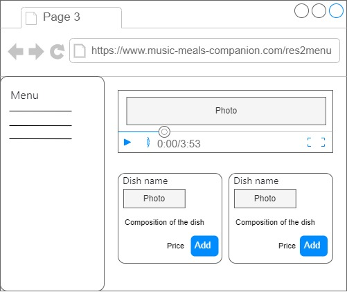

| NFR ID | Test Case ID | Опис кроків тестового сценарію                                                                                                              | Опис очікуваних результатів |
|--------|--------|---------------------------------------------------------------------------------------------------------------------------------------------------|-----------------------------|
| NFR1.1 | TC1.12 | Початкові умови: відкрита сторінка пошуку ресторану Кроки сценарію: відсутні                                                                  |          |
| NFR1.1 | TC1.13 | Початкові умови: успішно пройдено форму пощуку ресторану TC1.1 Кроки сценарію:  1) назва = Olio Pizza  2) категорія = італійська кухня |          |
| NFR1.1 | TC1.14 | Початкові умови: успішно пройдено форму пощуку ресторану TC1.1 1) Натиснуто кнопку «Пошук»                                                    |          |
